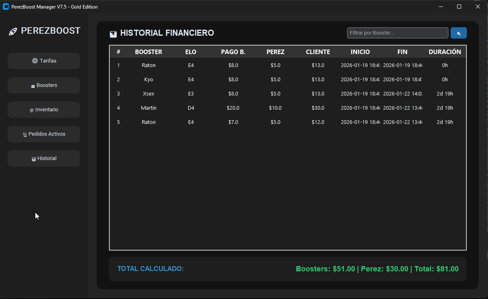

# PerezBoost Manager V7.5 🚀 (Professional Edition)

**A modular, high-performance management suite designed for Elo Boosting services, featuring a dual-interface architecture (GUI/CLI) and a robust relational database engine.**

---

## 🌟 Key Features

* **Dual Architecture:** Fully functional Graphical User Interface (GUI) built with **CustomTkinter** for modern desktop experiences and a lightweight Command Line Interface (CLI) for rapid terminal operations.
* **Dynamic Financial Engine:** Real-time calculation of client fees, booster payouts, and net profits based on performance (Winrate) and adjustable business rules.
* **Data-Driven Configuration:** Dedicated module to manage service prices and profit margins directly from the UI, eliminating hardcoded values and improving maintainability.
* **Smart Inventory Control:** Advanced account stock management featuring an automated "Abandonment Protocol" that ensures data integrity and account restoration.
* **Enterprise-Grade Data Safety:** Built-in self-rotating backup system for the SQLite engine, automatically maintaining the last 10 versions of the database to prevent data loss.

## 🏗️ System Architecture (Modular MVC-lite)

The project follows a strict **Separation of Concerns**, making it highly scalable and easy to debug:

* **`core/` (The Brain):** Handles the persistence layer (`database.py`) and pure business logic (`logic.py`) such as financial calculations and date management.
* **`modules/` (The Bridges):** Functional logic that connects the core engine with the user interfaces for Staff, Inventory, and Orders.
* **UI Layer:** Dual entry points via `gui_main.py` (Desktop App) and `cmd_main.py` (Terminal App).

## 🛠️ Tech Stack

* **Language:** Python 3.10+
* **UI Framework:** CustomTkinter (Modern Dark Mode GUI)
* **Database:** SQLite3 (Relational persistence)
* **Environment:** Virtual Environment (venv) supported

## 📸 Interface Preview

<div align="center">
  
  <p><em>Desktop Dashboard: Real-time order tracking, inventory management, and financial reporting.</em></p>
</div>

---

## ⚙️ Installation

1. **Clone the repository:**
   ```bash
   git clone [https://github.com/AndresPerez2406/PerezBoost-Manager-Pro.git](https://github.com/AndresPerez2406/PerezBoost-Manager-Pro.git)
   cd PerezBoost-Manager-Pro
   ```


2. **Create and activate a virtual environment (Recommended):**
   **Bash**

   ```
   python -m venv .venv
   # Windows:
   .venv\Scripts\activate
   # Linux/Mac:
   source .venv/bin/activate
   ```
3. **Install dependencies:**
   **Bash**

   ```
   pip install -r requirements.txt
   ```

## 🚀 How to Run

* **Standard Mode (GUI):** Run the following command for the complete desktop management experience:
  **Bash**

  ```
  python gui_main.py
  ```
* **Fast Mode (CLI):** Run the following command for quick terminal-based status checks and staff management:
  **Bash**

  ```
  python cmd_main.py
  ```

---

## 🔮 Roadmap & Upcoming Features

The project is under active development with a clear vision for the next major releases (V8.0+):

* **Visual Analytics Dashboard:** Implementation of interactive charts (Matplotlib/Plotly integration) to visualize monthly revenue trends and booster efficiency.
* **External API Integration:** Developing a secure bridge to sync order data directly with external service providers via REST APIs.
* **Automated Notification System:** Discord/Telegram webhook integration to notify staff automatically when a new account is added to the inventory.
* **Export Engine:** Advanced reporting module to export financial history and staff performance logs into Excel (`.xlsx`) and PDF formats.

---

### 👨‍💻 Developed by

**Andres Perez**
*Software Developer specialized in business automation and Python applications.*
